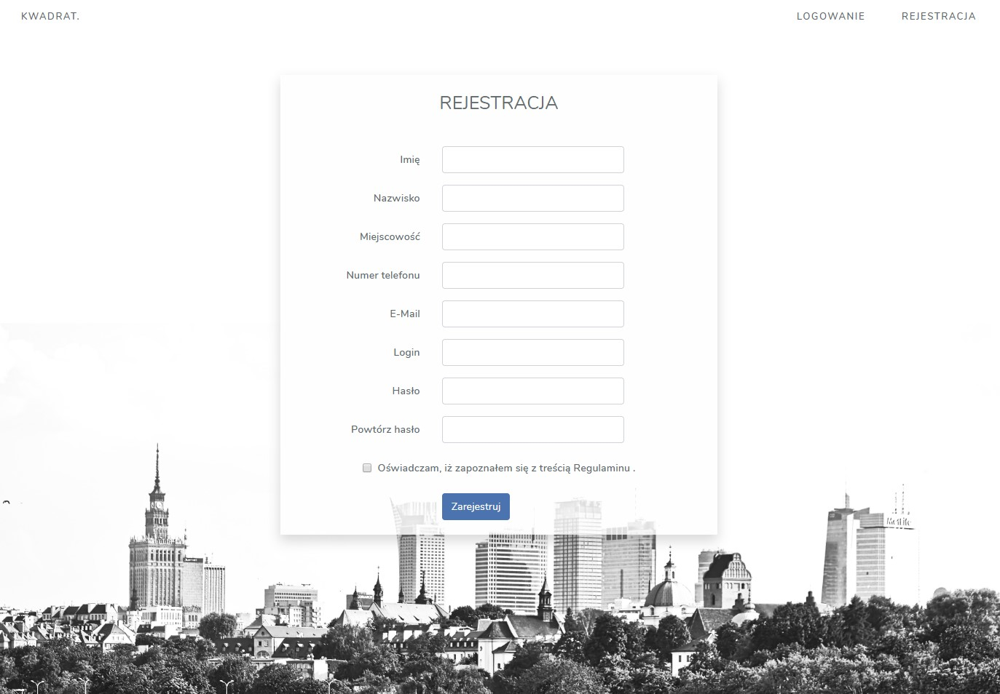
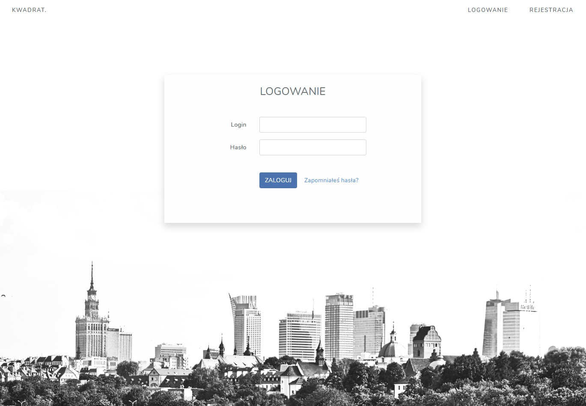
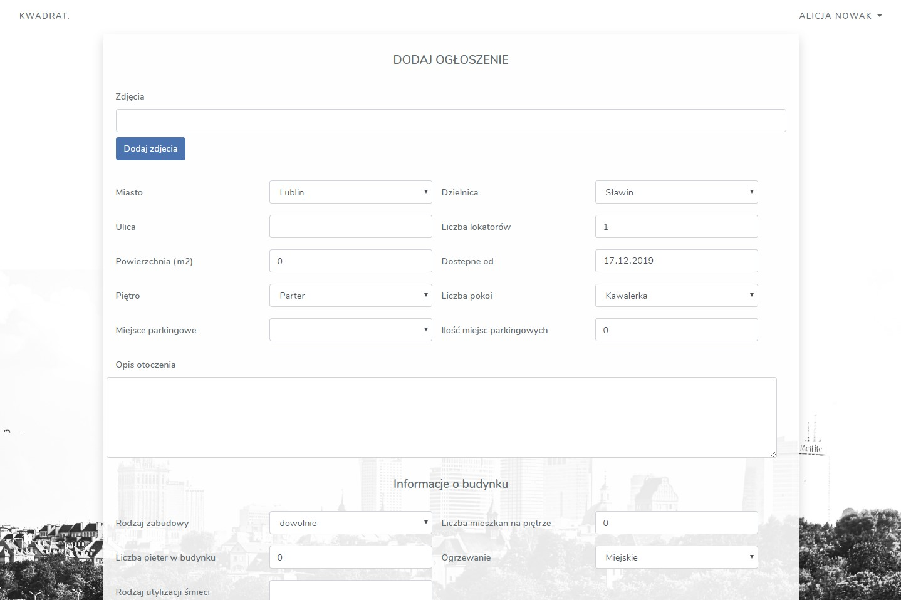
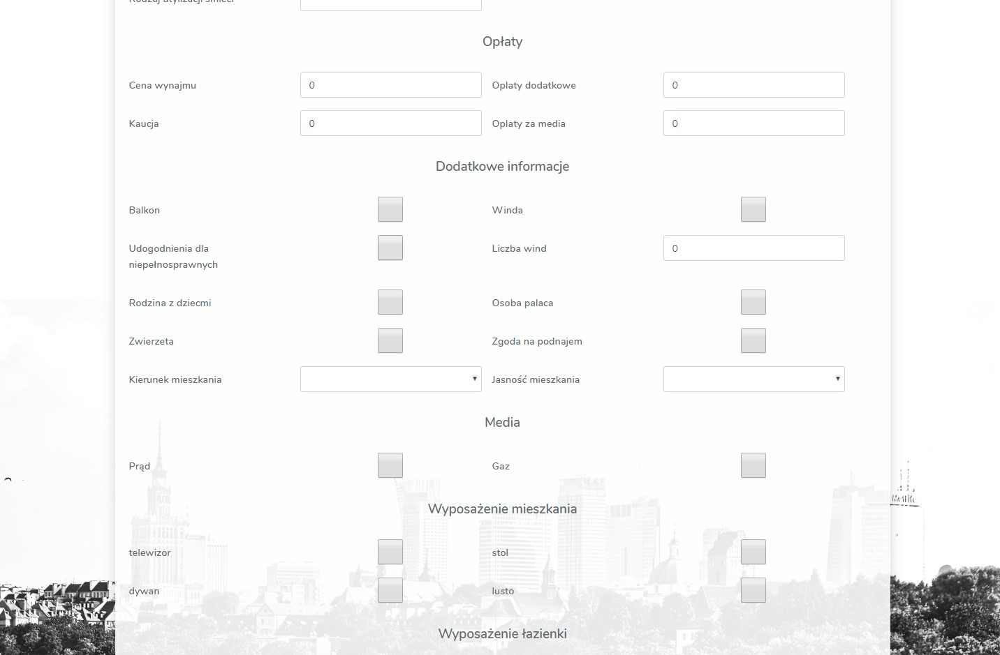
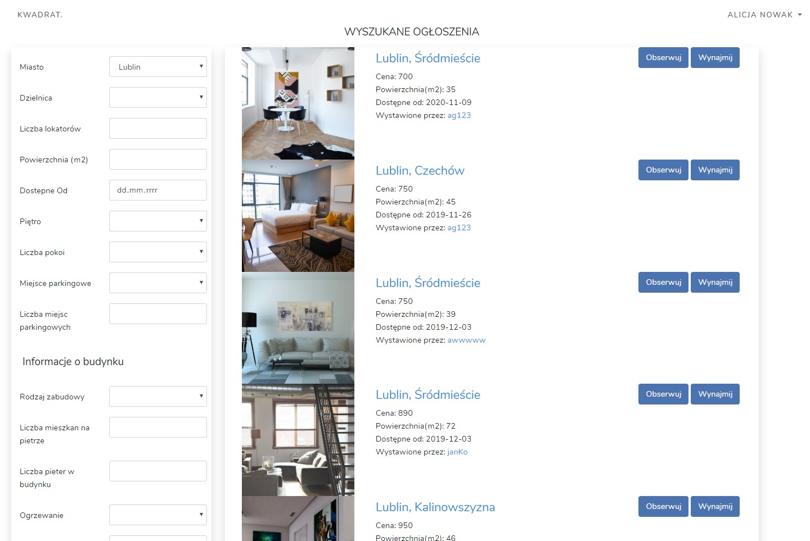
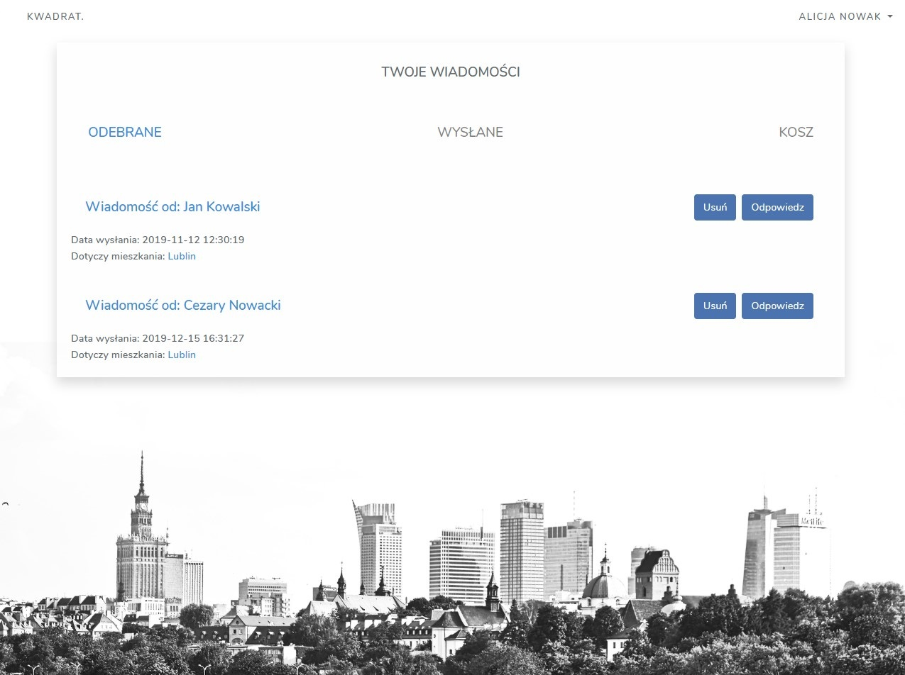
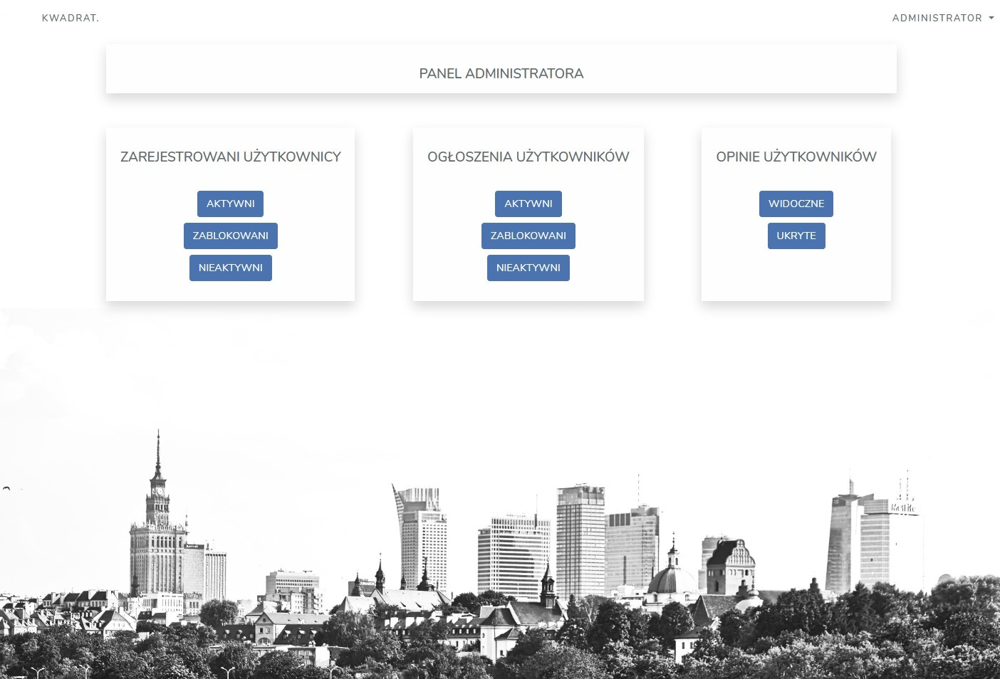

Aplikacja została utworzona na rzecz pracy inżynierskiej. Jest to aplikacja do wynajmu mieszkań.
Funkcje aplikacji:
    - dodawanie, przeglądanie, edycja, usuwanie ogłoszeń mieszkań
    - wyszukiwanie ogłoszeń poprzez użycie filtrów
    - dodawanie ogłoszeń do obserwowanych
    - dodawanie opinii
    - wysyłanie i odbieranie wiadomości dotyczących konkretnego mieszkania
    - panel administratora (blokowanie, edytowanie kont użytkowników, ogłoszeń oraz opini)
 

